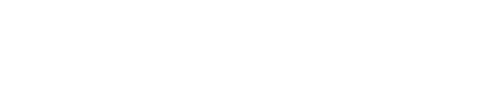
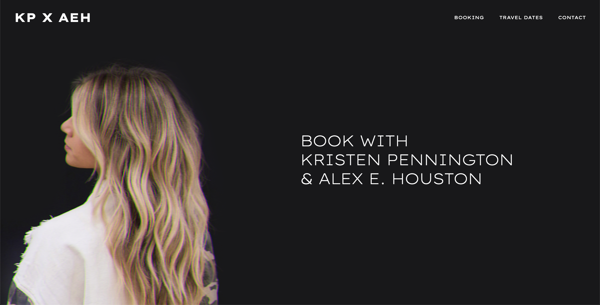
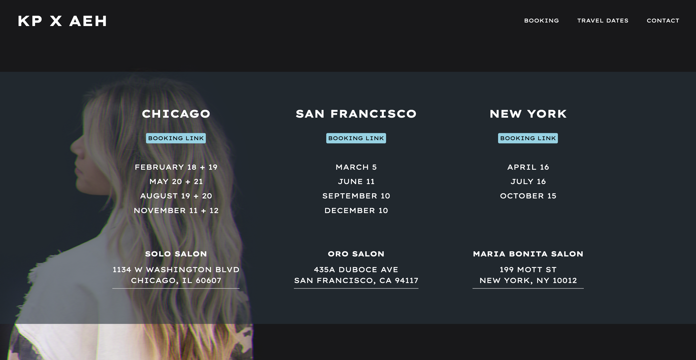
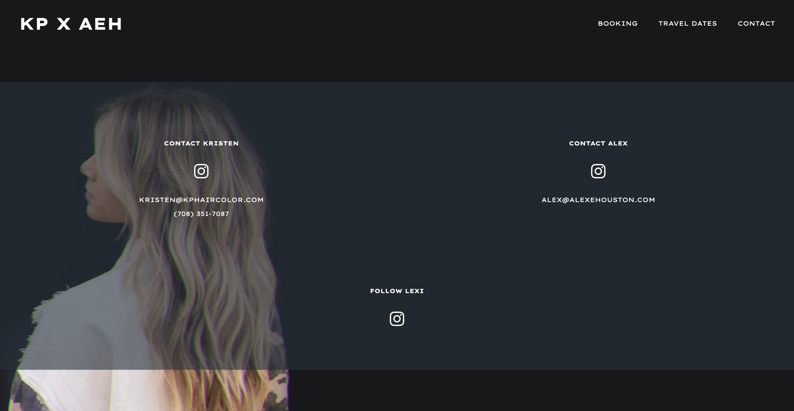
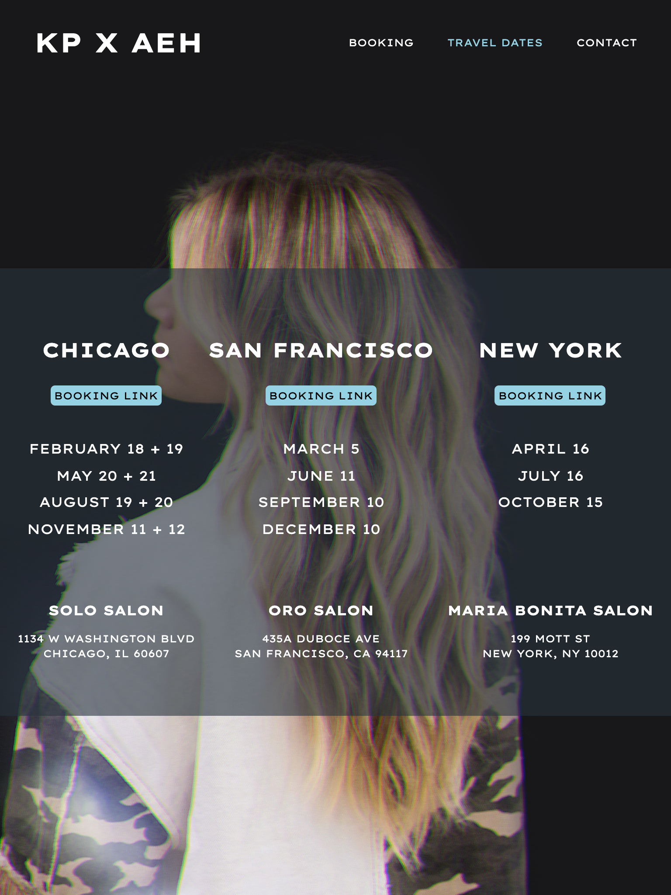
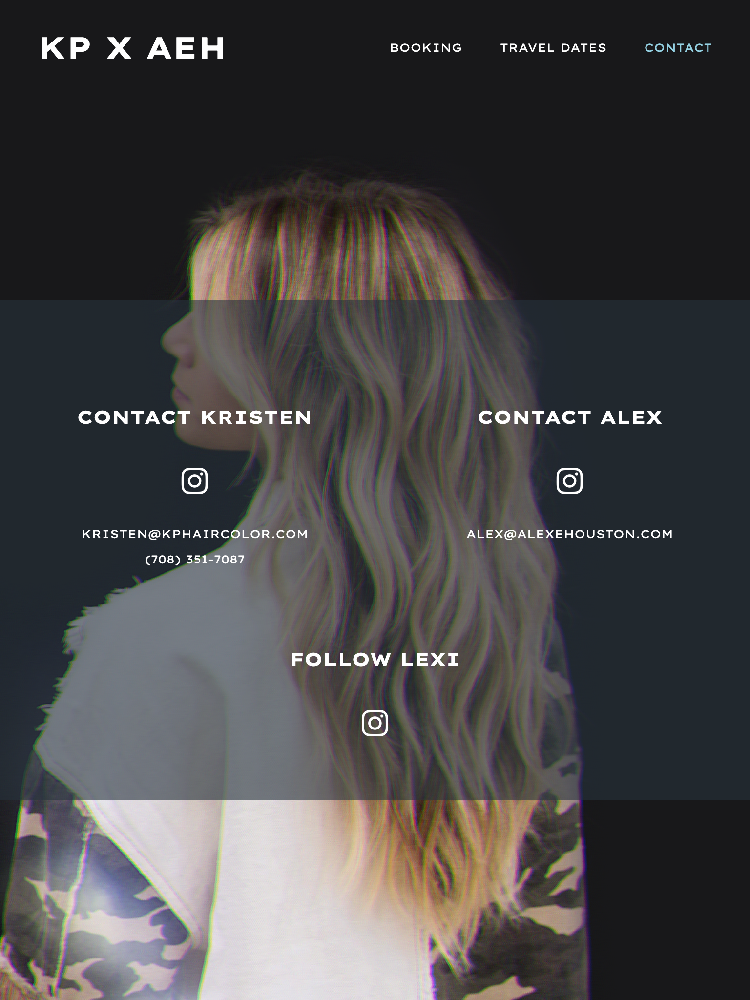

    

##### Created by <a href="https://alexehouston.github.io/portfolio/" target=”_blank”>Alex E. Houston</a>

 

# :pencil: Description

KPxAEH is a simple React.js application that houses the collaboration between hair stylists Alex Houston and Kristen Pennington. Clients are able to navigate to the site in order to book appointments.

<a href="https://squiz.herokuapp.com/" target=”_blank”>Deployed Link</a>

 

# :gear: Functionality

<h4 align="center">Home Page</h4> 

 
<h4 align="center">Travel Dates</h4> 

 
<h4 align="center">Contact</h4> 

 <h4 align="center">Mobile-View</h4> 

  
  &nbsp;&nbsp;&nbsp;&nbsp;&nbsp;&nbsp;&nbsp;&nbsp;
  
  &nbsp;&nbsp;&nbsp;&nbsp;&nbsp;&nbsp;&nbsp;&nbsp;
  

 <h4 align="center">Tablet-View</h4> 

  
  &nbsp;&nbsp;&nbsp;&nbsp;&nbsp;&nbsp;&nbsp;&nbsp;
  
  &nbsp;&nbsp;&nbsp;&nbsp;&nbsp;&nbsp;&nbsp;&nbsp;
  

 

# :computer: Technologies Used

    
    
    

